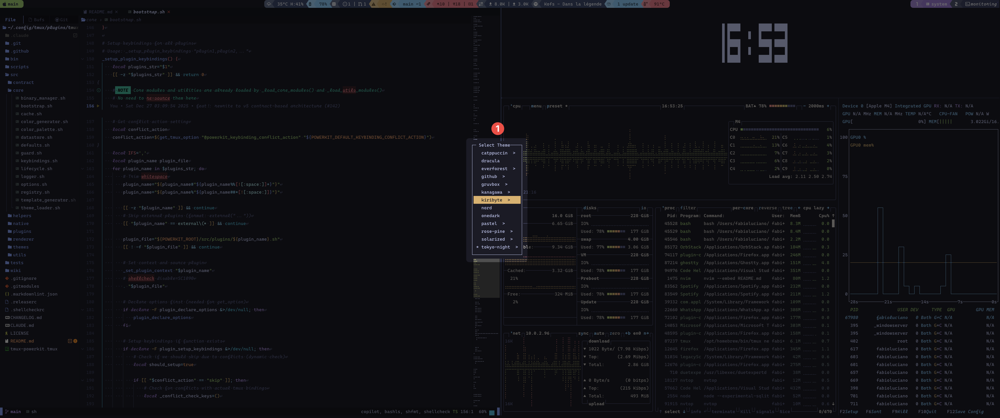
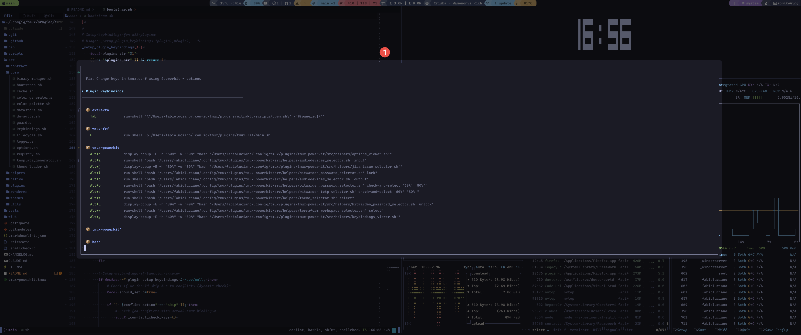
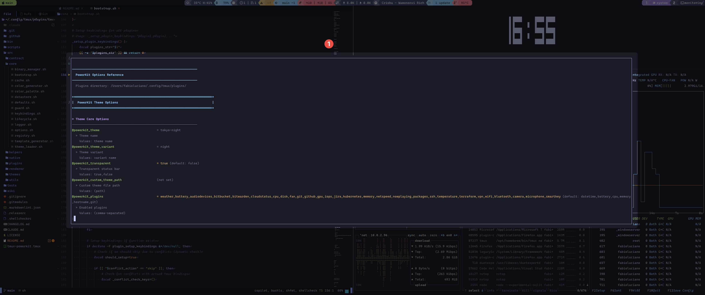

# Global Helpers

System-wide helpers not associated with specific plugins.

## theme_selector



Interactive theme selection.

**Keybinding**: `prefix + C-r` (configurable via `@powerkit_theme_selector_key`)

### Actions

| Action | Description |
|--------|-------------|
| `select` | Browse and apply themes |
| `preview` | List available themes |

### Usage

```bash
# Via keybinding
prefix + C-r

# Direct execution
./src/helpers/theme_selector.sh select
```

---

## keybindings_viewer



View all PowerKit keybindings.

**Keybinding**: `prefix + C-y` (configurable via `@powerkit_keybindings_key`)

### Actions

| Action | Description |
|--------|-------------|
| `view` | Show all keybindings in popup |
| `list` | List keybindings to stdout |

### Usage

```bash
# Via keybinding
prefix + C-y

# Direct execution
./src/helpers/keybindings_viewer.sh view
```

---

## options_viewer



View all PowerKit options and their values.

**Keybinding**: `prefix + C-e` (configurable via `@powerkit_options_key`)

### Actions

| Action | Description |
|--------|-------------|
| `view` | Show all options in popup |
| `search` | Search options by name |

### Usage

```bash
# Via keybinding
prefix + C-e

# Direct execution
./src/helpers/options_viewer.sh view
```

---

## log_viewer

View PowerKit logs for debugging.

### Actions

| Action | Description |
|--------|-------------|
| `view` | Show recent logs |
| `tail` | Follow logs in real-time |
| `clear` | Clear log file |

### Usage

```bash
./src/helpers/log_viewer.sh view
./src/helpers/log_viewer.sh tail
```

---

## keybinding_conflict_toast

Displays keybinding conflicts at startup.

This helper is automatically triggered when PowerKit detects keybinding conflicts and `@powerkit_keybinding_conflict_action` is set to `warn`.

### Configuration

```bash
# Show conflicts as toast notification
set -g @powerkit_keybinding_conflict_action "warn"

# Don't show notification (skip conflicting bindings silently)
set -g @powerkit_keybinding_conflict_action "skip"
```

---

## Plugin-Associated Helpers

These helpers are documented in their respective plugin pages:

| Helper | Plugin | Description |
|--------|--------|-------------|
| `audio_device_selector` | [audiodevices](PluginAudiodevices) | Select audio output device |
| `bitwarden_password_selector` | [bitwarden](PluginBitwarden) | Copy password from vault |
| `bitwarden_totp_selector` | [bitwarden](PluginBitwarden) | Copy TOTP code |
| `jira_issue_selector` | [jira](PluginJira) | Browse and open Jira issues |
| `kubernetes_selector` | [kubernetes](PluginKubernetes) | Switch context/namespace |
| `pomodoro_timer` | [pomodoro](PluginPomodoro) | Control pomodoro timer |
| `terraform_workspace_selector` | [terraform](PluginTerraform) | Switch Terraform workspace |

## Creating Helpers

See [Developing Helpers](DevelopingHelpers) for instructions on creating custom helpers.

## Related

- [Helper Contract](ContractHelper) - Helper specification
- [Developing Helpers](DevelopingHelpers) - Create helpers
- [Keybindings](Keybindings) - Keybinding configuration
