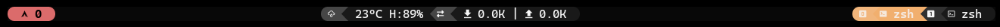
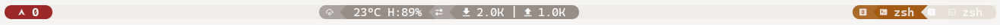
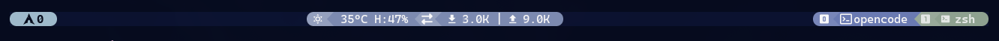
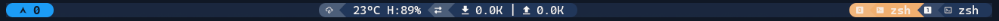
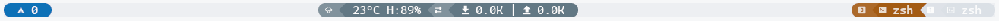
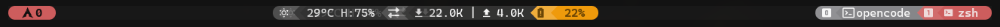
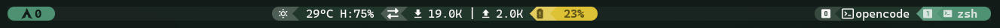
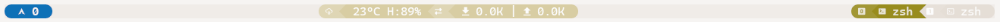

# Available Themes

PowerKit includes **40 themes** with **68 variants**.

## Theme Configuration

```bash
set -g @powerkit_theme "catppuccin"
set -g @powerkit_theme_variant "mocha"
```

---

## Abyss

Deep dark theme with warm accents.

**Source**: Oasis Abyss by uhs-robert

| Variant | Preview |
|---------|---------|
| dark |  |
| light |  |

| Variant | Background | Accent | Style |
|---------|------------|--------|-------|
| dark | `#080808` | `#e26e6e` | Dark |
| light | `#f3efeb` | `#9c2525` | Light |

```bash
set -g @powerkit_theme "abyss"
set -g @powerkit_theme_variant "dark"
```

---

## Atom

Inspired by Atom's One Dark theme.

**Source**: [atom.io](https://atom.io/themes/one-dark-syntax)

| Variant | Background | Accent |
|---------|------------|--------|
| dark | `#1d1f21` | `#61afef` |

```bash
set -g @powerkit_theme "atom"
set -g @powerkit_theme_variant "dark"
```

---

## Ayu

Modern and elegant theme with three distinct variants.

**Source**: [dempfi/ayu](https://github.com/dempfi/ayu)

| Variant | Background | Accent | Style |
|---------|------------|--------|-------|
| dark | `#0a0e14` | `#ffb454` | Dark |
| mirage | `#1f2430` | `#ffcc66` | Medium |
| light | `#fafafa` | `#ff9940` | Light |

```bash
set -g @powerkit_theme "ayu"
set -g @powerkit_theme_variant "dark"
```

---

## Catppuccin

Soothing pastel theme for the high-spirited.

**Source**: [catppuccin/catppuccin](https://github.com/catppuccin/catppuccin)

| Variant | Background | Accent | Style |
|---------|------------|--------|-------|
| mocha | `#1e1e2e` | `#cba6f7` | Darkest |
| macchiato | `#24273a` | `#c6a0f6` | Dark |
| frappe | `#303446` | `#ca9ee6` | Medium |
| latte | `#eff1f5` | `#8839ef` | Light |

```bash
set -g @powerkit_theme "catppuccin"
set -g @powerkit_theme_variant "mocha"
```

---

## Cobalt2

Classic blue theme by Wes Bos.

**Source**: [wesbos/cobalt2](https://github.com/wesbos/cobalt2-vscode)

| Variant | Background | Accent |
|---------|------------|--------|
| default | `#193549` | `#ffc600` |

```bash
set -g @powerkit_theme "cobalt2"
set -g @powerkit_theme_variant "default"
```

---

## Darcula

Classic JetBrains IDE dark theme.

**Source**: [JetBrains](https://www.jetbrains.com/)

| Variant | Background | Accent |
|---------|------------|--------|
| default | `#2b2b2b` | `#6897bb` |

```bash
set -g @powerkit_theme "darcula"
set -g @powerkit_theme_variant "default"
```

---

## Dracula

A dark theme for vampires.

**Source**: [draculatheme.com](https://draculatheme.com/)

| Variant | Background | Accent |
|---------|------------|--------|
| dark | `#282a36` | `#bd93f9` |

```bash
set -g @powerkit_theme "dracula"
set -g @powerkit_theme_variant "dark"
```

---

## Ethereal

Soft pastel color palette with dreamy aesthetic.



| Variant | Background | Accent |
|---------|------------|--------|
| default | `#0b1230` | `#a3bfd1` |

```bash
set -g @powerkit_theme "ethereal"
set -g @powerkit_theme_variant "default"
```

---

## Everforest

Comfortable green-based theme.

**Source**: [sainnhe/everforest](https://github.com/sainnhe/everforest)

| Variant | Background | Accent | Style |
|---------|------------|--------|-------|
| dark | `#2d353b` | `#d699b6` | Dark |
| light | `#fdf6e3` | `#df69ba` | Light |

```bash
set -g @powerkit_theme "everforest"
set -g @powerkit_theme_variant "dark"
```

---

## Flexoki

An inky color scheme for prose and code.

**Source**: [stephango.com/flexoki](https://stephango.com/flexoki)

| Variant | Background | Accent | Style |
|---------|------------|--------|-------|
| dark | `#100f0f` | `#da702c` | Dark |
| light | `#fffcf0` | `#bc5215` | Light |

```bash
set -g @powerkit_theme "flexoki"
set -g @powerkit_theme_variant "dark"
```

---

## GitHub

GitHub's Primer design system.

**Source**: [primer.style](https://primer.style/design)

| Variant | Background | Accent | Style |
|---------|------------|--------|-------|
| dark | `#0d1117` | `#a371f7` | Dark |
| light | `#ffffff` | `#8250df` | Light |

```bash
set -g @powerkit_theme "github"
set -g @powerkit_theme_variant "dark"
```

---

## Gruvbox

Retro groove color scheme.

**Source**: [morhetz/gruvbox](https://github.com/morhetz/gruvbox)

| Variant | Background | Accent | Style |
|---------|------------|--------|-------|
| dark | `#282828` | `#d79921` | Dark |
| light | `#fbf1c7` | `#b57614` | Light |

```bash
set -g @powerkit_theme "gruvbox"
set -g @powerkit_theme_variant "dark"
```

---

## Hackerman

Matrix-style neon green terminal theme.


| Variant | Background | Accent |
|---------|------------|--------|
| default | `#05060d` | `#4fe88f` |

```bash
set -g @powerkit_theme "hackerman"
set -g @powerkit_theme_variant "default"
```

---

## Horizon

Warm dark theme with vibrant colors.

**Source**: [horizontheme.netlify.app](https://horizontheme.netlify.app/)

| Variant | Background | Accent |
|---------|------------|--------|
| default | `#1c1e26` | `#e95678` |

```bash
set -g @powerkit_theme "horizon"
set -g @powerkit_theme_variant "default"
```

---

## Iceberg

Cool blue-gray theme with balanced contrast.

**Source**: [cocopon.github.io/iceberg.vim](https://cocopon.github.io/iceberg.vim/)

| Variant | Background | Accent | Style |
|---------|------------|--------|-------|
| dark | `#161821` | `#84a0c6` | Dark |
| light | `#e8e9ec` | `#2d539e` | Light |

```bash
set -g @powerkit_theme "iceberg"
set -g @powerkit_theme_variant "dark"
```

---

## Kanagawa

Inspired by Katsushika Hokusai's paintings.

**Source**: [rebelot/kanagawa.nvim](https://github.com/rebelot/kanagawa.nvim)

| Variant | Background | Accent | Style |
|---------|------------|--------|-------|
| dragon | `#181616` | `#8992a7` | Darkest |
| lotus | `#f2ecbc` | `#b35b79` | Light |

```bash
set -g @powerkit_theme "kanagawa"
set -g @powerkit_theme_variant "dragon"
```

---

## Kiribyte

Soft pastel theme with purple-lavender accents.

| Variant | Background | Accent | Style |
|---------|------------|--------|-------|
| dark | `#2a2b3d` | `#d4c5ff` | Dark |
| light | `#f5f4f0` | `#9b7fc9` | Light |

```bash
set -g @powerkit_theme "kiribyte"
set -g @powerkit_theme_variant "dark"
```

---

## Lagoon

Deep ocean theme with blue accents.

**Source**: Oasis Lagoon by uhs-robert

| Variant | Preview |
|---------|---------|
| dark |  |
| light |  |

| Variant | Background | Accent | Style |
|---------|------------|--------|-------|
| dark | `#1a283f` | `#1ca0fd` | Dark |
| light | `#f0f2f5` | `#0970b8` | Light |

```bash
set -g @powerkit_theme "lagoon"
set -g @powerkit_theme_variant "dark"
```

---

## Material

Material Design inspired theme with multiple variants.

**Source**: [material-theme.site](https://material-theme.site/)

| Variant | Background | Accent | Style |
|---------|------------|--------|-------|
| default | `#263238` | `#80cbc4` | Default |
| ocean | `#0f111a` | `#84ffff` | Ocean |
| palenight | `#292d3e` | `#c792ea` | Palenight |
| lighter | `#fafafa` | `#39adb5` | Light |

```bash
set -g @powerkit_theme "material"
set -g @powerkit_theme_variant "default"
```

---

## Matte Black

Minimalist monochrome with grayscale and warm red accents.



| Variant | Background | Accent |
|---------|------------|--------|
| default | `#181818` | `#d35f5f` |

```bash
set -g @powerkit_theme "matte-black"
set -g @powerkit_theme_variant "default"
```

---

## Molokai

Port of the monokai theme for TextMate.

**Source**: [tomasr/molokai](https://github.com/tomasr/molokai)

| Variant | Background | Accent |
|---------|------------|--------|
| dark | `#1b1d1e` | `#a6e22e` |

```bash
set -g @powerkit_theme "molokai"
set -g @powerkit_theme_variant "dark"
```

---

## Monokai

Classic Monokai Pro colorscheme with vibrant syntax colors.

**Source**: [monokai.pro](https://monokai.pro/)

| Variant | Background | Accent | Style |
|---------|------------|--------|-------|
| dark | `#2d2a2e` | `#ff6188` | Dark |
| light | `#fdfff5` | `#f9267a` | Light |

```bash
set -g @powerkit_theme "monokai"
set -g @powerkit_theme_variant "dark"
```

---

## Moonlight

Dark theme with neon colors.

**Source**: [atomiks/moonlight-vscode-theme](https://github.com/atomiks/moonlight-vscode-theme)

| Variant | Background | Accent |
|---------|------------|--------|
| default | `#212337` | `#82aaff` |

```bash
set -g @powerkit_theme "moonlight"
set -g @powerkit_theme_variant "default"
```

---

## Night Owl

Dark theme for night owls by Sarah Drasner.

**Source**: [sdras/night-owl-vscode-theme](https://github.com/sdras/night-owl-vscode-theme)

| Variant | Background | Accent | Style |
|---------|------------|--------|-------|
| default | `#011627` | `#82aaff` | Dark |
| light | `#fbfbfb` | `#4876d6` | Light |

```bash
set -g @powerkit_theme "night-owl"
set -g @powerkit_theme_variant "default"
```

---

## Nord

Arctic, north-bluish color palette.

**Source**: [nordtheme.com](https://www.nordtheme.com/)

| Variant | Background | Accent |
|---------|------------|--------|
| dark | `#2e3440` | `#88c0d0` |

```bash
set -g @powerkit_theme "nord"
set -g @powerkit_theme_variant "dark"
```

---

## Oceanic Next

Dark theme with oceanic blue palette.

**Source**: [voronianski/oceanic-next-color-scheme](https://github.com/voronianski/oceanic-next-color-scheme)

| Variant | Background | Accent | Style |
|---------|------------|--------|-------|
| default | `#1b2b34` | `#6699cc` | Default |
| darker | `#16242c` | `#6699cc` | Darker |

```bash
set -g @powerkit_theme "oceanic-next"
set -g @powerkit_theme_variant "default"
```

---

## One Dark

Inspired by Atom's One Dark theme.

**Source**: [Atom One Dark](https://atom.io/themes/one-dark-syntax)

| Variant | Background | Accent |
|---------|------------|--------|
| dark | `#282c34` | `#61afef` |

```bash
set -g @powerkit_theme "onedark"
set -g @powerkit_theme_variant "dark"
```

---

## Osaka Jade

Deep green theme inspired by Japanese aesthetics.



| Variant | Background | Accent |
|---------|------------|--------|
| default | `#1a2521` | `#509475` |

```bash
set -g @powerkit_theme "osaka-jade"
set -g @powerkit_theme_variant "default"
```

---

## Pastel

Soft pastel color palette.

| Variant | Background | Accent | Style |
|---------|------------|--------|-------|
| dark | `#1a1b26` | `#e88fb5` | Dark |
| light | `#fafafa` | `#e88fb5` | Light |

```bash
set -g @powerkit_theme "pastel"
set -g @powerkit_theme_variant "dark"
```

---

## Poimandres

A minimal, dark theme for comfortable coding.

**Source**: [drcmda/poimandres-theme](https://github.com/drcmda/poimandres-theme)

| Variant | Background | Accent |
|---------|------------|--------|
| default | `#1b1e28` | `#5de4c7` |

```bash
set -g @powerkit_theme "poimandres"
set -g @powerkit_theme_variant "default"
```

---

## Ristretto

Warm and cozy palette with soft pastel tones over dark brown background.


| Variant | Background | Accent |
|---------|------------|--------|
| default | `#3a383b` | `#f38d70` |

```bash
set -g @powerkit_theme "ristretto"
set -g @powerkit_theme_variant "default"
```

---

## Rose Pine

All natural pine, faux fur and a bit of soho vibes.

**Source**: [rosepinetheme.com](https://rosepinetheme.com/)

| Variant | Background | Accent | Style |
|---------|------------|--------|-------|
| main | `#191724` | `#c4a7e7` | Darkest |
| moon | `#232136` | `#c4a7e7` | Dark |
| dawn | `#faf4ed` | `#907aa9` | Light |

```bash
set -g @powerkit_theme "rose-pine"
set -g @powerkit_theme_variant "main"
```

---

## Slack

Slack's dark theme color palette.

**Source**: [slack.com](https://slack.com)

| Variant | Background | Accent |
|---------|------------|--------|
| dark | `#1a1d21` | `#36c5f0` |

```bash
set -g @powerkit_theme "slack"
set -g @powerkit_theme_variant "dark"
```

---

## Snazzy

Elegant dark theme with vibrant colors.

**Source**: [sindresorhus/hyper-snazzy](https://github.com/sindresorhus/hyper-snazzy)

| Variant | Background | Accent |
|---------|------------|--------|
| default | `#282a36` | `#57c7ff` |

```bash
set -g @powerkit_theme "snazzy"
set -g @powerkit_theme_variant "default"
```

---

## Solarized

Precision colors for machines and people.

**Source**: [ethanschoonover.com/solarized](https://ethanschoonover.com/solarized/)

| Variant | Background | Accent | Style |
|---------|------------|--------|-------|
| dark | `#002b36` | `#268bd2` | Dark |
| light | `#fdf6e3` | `#268bd2` | Light |

```bash
set -g @powerkit_theme "solarized"
set -g @powerkit_theme_variant "dark"
```

---

## Spacegray

A hyperminimal UI theme with flat design.

**Source**: [kkga/spacegray](https://github.com/kkga/spacegray)

| Variant | Background | Accent |
|---------|------------|--------|
| dark | `#2b303b` | `#96b5b4` |

```bash
set -g @powerkit_theme "spacegray"
set -g @powerkit_theme_variant "dark"
```

---

## Starlight

Celestial theme with blue accents.

**Source**: Oasis Starlight by uhs-robert

| Variant | Preview |
|---------|---------|
| dark |  |
| light |  |

| Variant | Background | Accent | Style |
|---------|------------|--------|-------|
| dark | `#080808` | `#3aacfd` | Dark |
| light | `#f3efeb` | `#0a70b8` | Light |

```bash
set -g @powerkit_theme "starlight"
set -g @powerkit_theme_variant "dark"
```

---

## SynthWave

Retro synthwave aesthetic with neon colors.

**Source**: [robb0wen/synthwave-vscode](https://github.com/robb0wen/synthwave-vscode)

| Variant | Background | Accent |
|---------|------------|--------|
| 84 | `#262335` | `#ff7edb` |

```bash
set -g @powerkit_theme "synthwave"
set -g @powerkit_theme_variant "84"
```

---

## Tokyo Night

A clean, dark theme with subtle colors.

**Source**: [folke/tokyonight.nvim](https://github.com/folke/tokyonight.nvim)

| Variant | Background | Accent | Style |
|---------|------------|--------|-------|
| night | `#1a1b26` | `#bb9af7` | Darkest |
| storm | `#24283b` | `#bb9af7` | Dark |
| day | `#e1e2e7` | `#9854f1` | Light |

```bash
set -g @powerkit_theme "tokyo-night"
set -g @powerkit_theme_variant "night"
```

---

## Vesper

Dark theme with warm orange accents.

**Source**: [raunofreiberg/vesper](https://github.com/raunofreiberg/vesper)

| Variant | Background | Accent |
|---------|------------|--------|
| default | `#101010` | `#ffc799` |

```bash
set -g @powerkit_theme "vesper"
set -g @powerkit_theme_variant "default"
```

---

## Creating Custom Themes

See [Developing Themes](DevelopingThemes) for instructions on creating your own theme.

## Related

- [Theme Contract](ContractTheme) - Required colors
- [Developing Themes](DevelopingThemes) - Create themes
- [Configuration](Configuration) - Theme options
